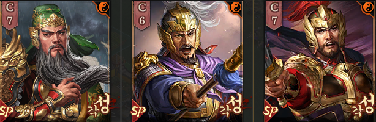
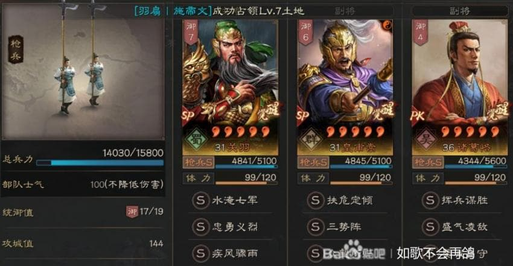
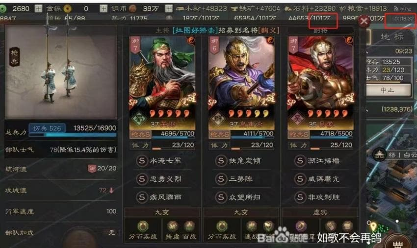

# 도강창

#### 덱조합

장수|SP관우||SP황보숭||SP여몽||비고|
|:---:|:---:|:----:|:---:|:----:|:---:|:----:|:----:|
|전법|충성용맹|질풍취우|삼세진|초선차전|비공제승|오만한계획|기본형
||충성용맹|질풍취우|삼세진|중망소귀|비공제승|오만한계획|초선 대체형
|병서|맹렬한 싸움|백전 엄허|차분한 대응|격군 속전|뒤늦은 출발|신기 점괘||
||이치격란|귀모 장위||||||

#### 1군 육성 빌드업

[참고링크 : (DC)도강창 전보여행](https://gall.dcinside.com/mgallery/board/view/?id=3kingdoms&no=201081)

1) 관악제 or 강하제 개척
2) 2일차 새벽 2시 훈련소 개방
    * SP관우, SP여몽 각 10회 훈련으로 20시간 투자
    * 이외 시간에 병기 육성
3) 3일차 11시 이전(서버 오픈 후 48시간, 초보자기간) 1차 전환

|장수|SP관우||SP황보숭||제갈각||
|:---:|:---:|:----:|:---:|:---:|:---:|:---:|
|전법|충성용맹|질풍취우|삼세진|중망소귀|기세등등|성벽사수|

4) 8군왕 10군영 3사령단 이후 최종 전환

|장수|SP관우||SP황보숭||SP여몽||
|:---:|:---:|:----:|:---:|:---:|:---:|:---:|
|전법|충성용맹|질풍취우|삼세진|중망소귀|오만한계획|비공제승|

