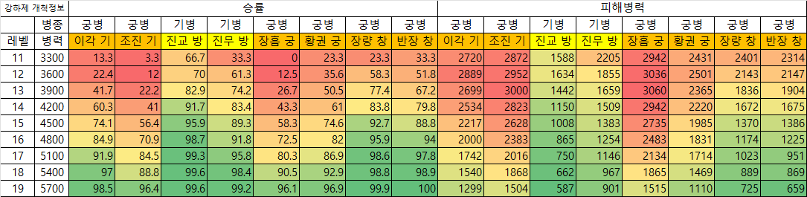

#관악제 개척

## 링크

https://www.gamersky.com/handbook/202401/1697930.shtml

https://cafe.naver.com/sgzqookka/148479

## 시작 개척덱(~20렙)

### 1) 4토

기병폼 (궁병, 방패병, 곽사 상대)

제갈각|하후연|강유
|:---:|:---:|:---:|
기세등등|맨몸의혈전|서량철기
통솔|무력|무력

궁병폼 (능조, 창병 상대)

제갈각|하후연|강유
|:---:|:---:|:---:|
기세등등|맨몸의혈전|무당비군
통솔|무력|무력

* 4토 진입순서 : 장익방패 > 조창방패 > 능조기병 > 장량창병 > 주환창병 > 장흠궁병 > 황권궁병 > 곽사기병
* 곽사기병이 난이도가 높다.

### 2) 5토 (20렙 전) : 4토와 동일한 조합

기병폼 (궁병, 방패병, 기병 상대)

제갈각|하후연|강유
|:---:|:---:|:---:|
기세등등|맨몸의혈전|서량철기
통솔|무력|무력

궁병폼 (창병 상대)

제갈각|하후연|강유
|:---:|:---:|:---:|
기세등등|맨몸의혈전|무당비군
통솔|무력|무력

개척 시뮬레이션 결과

* 첫 5토 : 진교를 우선적으로 찾는다, 없으면 진무를 찾는다. 다른 5토는 진입하지 않는다.
* 11~16렙 : 폭탄 조건을 만족한 상태에서(11렙 4200 / 12렙 3900 / 13렙 3600 / 14렙 3300 / 15렙 3000) 진교/진무/장량/반장을 진입한다.
* 17렙 : 이각에 진입한다.
* 18렙 : 조진/장흠/황권에 진입한다.

## 20렙 이후 개척덱

* 20렙 : __아무 5토나 폭격한다.__
* 25렙 : 6토 시도한다.
* 30렙 : 6구리를 시도한다.
* 35렙 : 5군영을 완성하고 7토를 트라이 한다.

### 1) 5토

기병폼 (궁병, 방패병, 기병 상대)

제갈각|하후연|강유
|:---:|:---:|:---:|
기세등등|맨몸의혈전|일망타진
__서량철기__|유리한기회|__다리끊기__
통솔|무력|무력
민첩|민첩|민첩

궁병폼 (창병 상대)

제갈각|하후연|강유
|:---:|:---:|:---:|
기세등등|맨몸의혈전|일망타진
__잠룡진__|유리한기회|__무당비군__
통솔|무력|무력
민첩|민첩|민첩

### 2) 6토

제갈각|하후연|강유
|:---:|:---:|:---:|
기세등등|맨몸의혈전|__임기제승__
잠룡진|유리한기회|무당비군
통솔|무력|__지력__
민첩|민첩|민첩

* 20렙 이후 궁병폼 대비 임기제승이 다르고, 지력 셋팅이다. 귀찮으면 5토 궁병폼으로 6토를 들어가자.

* 6토 진입순서 : 가규(창) > 조창(기) > 주환(기) > 정봉(창) > 곽회(방) > 주치(궁) > 한당(궁) > 문빙(방)

### 2) 7토

제갈각|하후연|강유
|:---:|:---:|:---:|
기세등등|맨몸의혈전|임기제승
잠룡진|유리한기회|무당비군
통솔|무력|지력
민첩|민첩|민첩

* 속도 셋팅은 ___없다___

* 필요 군영 : 5군영 / 안전 군영 : 10군영

* 잠룡진이 없다면 병서 열리기 전에 7토는 들어가지 않는다.

* 7토 난이도 : 조운(창) > 주유(궁) > 하후돈(기) > 황개(궁) > 장료(창) > 장각(방) > 여포(기) > 장비(방)