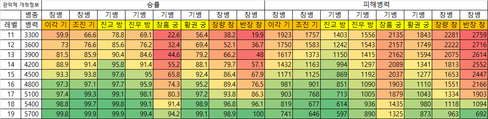

#관악제 개척

## 링크

https://www.gamersky.com/handbooksy/202306/1611047.shtml

https://www.gamersky.com/handbooksy/202304/1590063.shtml

https://cafe.naver.com/sgzqookka/148406

## 시작 개척덱(~20렙)

* 관은병은 악진보다 속성이 10 더있어야 한다. -> 속도3, 무력7 추가 부여 필요 (관은병 무력, 속도 1위)

### 1) 4토

창병폼 (주환, 기병 상대)

제갈각|관은병|악진
|:---:|:---:|:---:|
기세등등|청주병|사쟁선부
통솔|무력|무력
-|무력/속도1위|무력/속도2위|

창병폼 (장량 상대)

제갈각|관은병|악진
|:---:|:---:|:---:|
청주병|기형진|사쟁선부
통솔|무력|무력
-|무력/속도1위|무력/속도2위|

기병폼 (궁병, 방패병 상대)

제갈각|관은병|악진
|:---:|:---:|:---:|
기세등등|서량철기|사쟁선부
통솔|무력|무력
-|무력/속도1위|무력/속도2위|

* 4토 진입순서 : 능조기병 > 장익방패 > 곽사기병 > 조창방패 > 장량창병 
장흠궁병, 주환창병, 황권궁병은 10레벨 이후에 진입하며, 가급적 스킵한다.
6렙~9렙 구간에서 4토 폭탄을 던지고, 10렙~12렙 구간의 4토는 폭탄 없이 들어간다.(경험치 손실 최소화)

* 폭탄은 10레벨 이전에만 던지고, 10레벨 이후부터 4토에는 폭탄을 던지지 않는다.

### 2) 5토 (20렙 전)

기병폼 (궁병, 방패병 상대)

제갈각|관은병|악진
|:---:|:---:|:---:|
기세등등|서량철기|사쟁선부
통솔|무력|무력
-|무력/속도1위|무력/속도2위|

창병폼 (기병, 창병 상대)

제갈각|관은병|악진
|:---:|:---:|:---:|
청주병|기형진|사쟁선부
통솔|무력|무력
-|무력/속도1위|무력/속도2위|

개척 시뮬레이션 결과

* 첫 5토 : 조진을 우선적으로 찾는다, 없으면 진무를 찾는다. 다른 5토는 진입하지 않는다.
* 11~13렙 : 폭탄 조건을 만족한 상태에서(11렙 4200 / 12렙 3900 / 13렙 3600) 이각/조진/진무/황권을 진입한다.
* 14렙 : 폭탄 조건을 만족하지 않아도 이각/조진/진무/황권을 진입한다.
* 15렙 : 진교에 진입한다.
* 18렙 : 장량/반장에 진입한다.
* __장흠은 20렙 전에는 진입하지 않는다.__

13렙 이전 : 수비병 5000명 이하 and 수비병주장 1700명 이하에서 5토 진입
15렙 이전 : 수비병 7000명 이하일때 5토 진입
16렙 : 노폭탄 진입 가능

## 20렙 이후 개척덱

* 20렙 : __아무 5토나 폭격한다.__
* 25렙 : 6토 시도한다. + 2+1을 한다.
* 30렙 : 6구리를 시도한다.
* 35렙 : 5군영을 완성하고 7토를 트라이 한다.

### 1) 5토

관은병|악진|제갈각
|:---:|:---:|:---:|
청주병|사쟁선부|잠피기봉
다리끊기|삼세진|관우의상처
무력|무력|지력
속도1위|속도2위|속도3위|
유린/민첩|유린/민첩|유린/지원

* 25렙 이후 2+1을 진행한다.
관은병|악진|제갈각
|:---:|:---:|:---:|
청주병|사쟁선부|잠피기봉
다리끊기|삼세진|관우의상처

### 2) 6토

관은병|악진|제갈각|쫄
|:---:|:---:|:---:|:---:|
충성용맹|사쟁선부|기세등등|서량철기/청주병|
다리끊기|문무겸비|봉시진|

관은병 + 제갈각 / 악진 + 제갈각 조합은 청주병을 채용한 창병으로 진입한다.
관은병 + 악진 조합은 토지수비군에 따라 기/창 전환을 한다.

* 6토 난이도 : 조창(기) < 주환(기) < 곽희(방) < 문빙(방) < 정봉(창) / 주치(궁) < 한당(궁) < 가규(창)

### 2) 7토

관은병|악진|제갈각
|:---:|:---:|:---:|
__충성용맹__|사쟁선부|잠피기봉
다리끊기|삼세진|관우의상처
무력|무력|지력
속도1위|속도2위|속도3위|
유린/민첩|유린/민첩|유린/지원

* 관은병과 악진의 속도를 장료(128.66)이상으로 맞춘다.

* 필요 군영 : 5군영 / 안전 군영 : 10군영

* 7토 난이도 : 장각(방) < 조운(창) < 황개(궁) < 주유(궁) < 여포(기) < 장료(창) / 하후돈(기) < 장비(방)