#법마제 개척

## 링크

https://mp.weixin.qq.com/s/7UdPKz3yByle9_asdj_T6Q

https://www.yx400.com/show-jQvHqfYJyk.html

https://www.douyin.com/search/%E4%B8%89%E5%9B%BD%E5%BF%97%E6%88%98%E7%95%A5%E7%89%88%E6%B3%95%E5%85%8B%E9%A9%AC%E5%BC%80%E8%8D%92?modal_id=7400047130867420443&type=general

https://www.douyin.com/search/%E4%B8%89%E5%9B%BD%E5%BF%97%E6%88%98%E7%95%A5%E7%89%88%E6%B3%95%E5%85%8B%E9%A9%AC%E5%BC%80%E8%8D%92?modal_id=7415174570824584500&type=general

## 시작 개척덱(~20렙)

### 1) 4토

법정|SP마초|제갈각
|:---:|:---:|:---:|
잠룡진|최봉단인|해번위
통솔|무력|통솔

* 4토 진입순서 : 능조기병 > 장익방패 > 곽사기병 > 조창방패 > 장량창병 
가능한 능조, 장익, 곽사를 찾아서 해결한다.

* __5렙부터 시작해서 4토 4개 점령후 10렙이 되면 5토에 진입한다.__
    * 모든 4토는 고정폭탄(장양, 손상향, 마초)을 2번 던지고 진입한다.
    * 폭탄의 전법은 10레벨로 설정한다.
        * 전법 점수가 부족하면 개척부대의 전법점수를 회수해서 사용 후, 개척부대 출진하여 이동준이 전법점수를 찍어준다.

### 2) 5토 (20렙 전)

법정|SP마초|제갈각
|:---:|:---:|:---:|
잠룡진|최봉단인|해번위
통솔|무력|35속+통솔

* 고정폭탄과 혼란폭탄을 합쳐 6폭탄을 준비한다.
    * 베스트 : 고정폭탄 6개
    * 준비 가능한 폭탄의 개수가 1개 줄어들 때 마다, 5토 진입 레벨을 2레벨 상승시킨다.
        * ex> 폭탄 준비 수량 4개 -> 5토 진입 레벨 = 14레벨
        * 단, 봉시진폭탄 2 + 혼란폭탄 2 + 파군승리 폭탄 2의 경우 6폭탄이 가능하므로, 대부분의 경우 6폭탄을 준비하는 것을 권장한다.

* 10레벨 ~ 14레벨 : 조진기병 4개 찾아 진입
    * 주장병력 2500이하 + 전체병력 5500이하 일때 확정승리
* 12레벨 이후 진무방, 장량창 공략 시작
* 14레벨 이후 군기병 공략 시작
* 반장창은 16레벨 이후 진입
* 진교는 1+2에 마초가 진입하도록 남겨둔다.
* 주성과 가까운 궁병(황권, 장흠)은 수비군 변경문서를 사용한다.

## 20렙 이후 개척덱

* 20렙 : 궁병+진교방 제외한 5토에 진입한다.
* 22렙 : 6토를 2개 시도한다. -> 24~25레벨 달성
* 25렙 : 2+1 / 1+2 운영을 시작한다.
* 30렙 : 6구리를 시도한다.
* 35렙 : 5군영을 완성하고 7토를 트라이 한다.

### 1) 5토

법정|SP마초|제갈각
|:---:|:---:|:---:|
잠룡진|유리한기회|해번위
기세등등|최봉단인|임기제승
통솔|무력|35속+__지력__

* 22레벨이 될 때 까지 5토를 진입한다.
* 20레벨 이전과 동일하게 궁병과 진교방패는 진입하지 않는다.

### 2) 6토

법정|SP마초|제갈각
|:---:|:---:|:---:|
잠룡진|유리한기회|해번위
기세등등|최봉단인|__도심혹적__
통솔|무력|__지력__

* 가까운 6토에 최대한 많은 폭탄을 던지고 진입한다.
* 6토 우선순위 : 조창, 곽회, 정봉
* 7군왕 전에는 최대 2개의 6토만 진입한다.

### 3) 2+1 / 1+2

* 개척부대 25레벨 달성 이후 2+1과 1+2를 운영한다.
    * 사용 장수 : 왕원희, 황월영, 이만성
* 주의사항 : 적군 부대의 총 숫자는 아군 부대의 3배를 넘지않도록 한다.
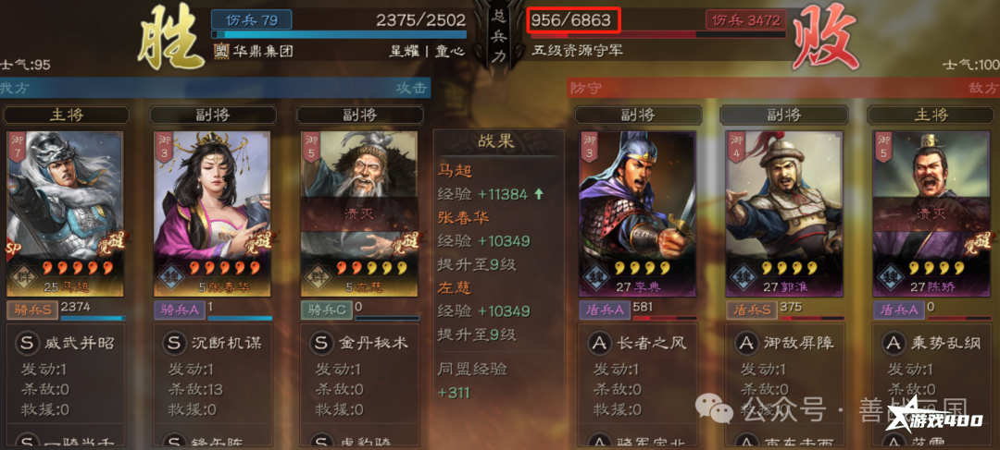
    * 가능한 폭탄을 2번 던지고 개척 부대가 진입한다.

* 마초 + 황월영 + 이만성 : 폭탄을 최대한 많이 던지고 진교방패에 진입한다.

    SP마초|황월영|이만성
    |:---:|:---:|:---:|
    적진습격|호표기|봉시진
    최봉단인||

* 제갈각 + SP황월영/법정 + 왕원희(무당비군) : 장량창/반장창에 폭탄을 최대한 많이 던지고 진입한다.

    제갈각|SP황월영/법정|왕원희
    |:---:|:---:|:---:|
    임기제승|불 난데 부채질|__무당비군__
    상병벌모|불타는 군영|
    35속+지력|지력|지력

* 제갈각 + SP황월영/법정 + 왕원희(백이병) : 진무방/조진기/이각기에 폭탄을 최대한 많이 던지고 진입한다.

    제갈각|SP황월영/법정|왕원희
    |:---:|:---:|:---:|
    임기제승|불 난데 부채질|__백이병__
    불타는 군영|뒤섞인 위서|
    35속+지력|지력|지력

* (보너스) 2 + 왕원희(20렙 이후)

    왕원희|법정|제갈각
    |:---:|:---:|:---:|
    임기제승|백이병|불꽃바람
    불난데부채질|기세등등|불타는군영

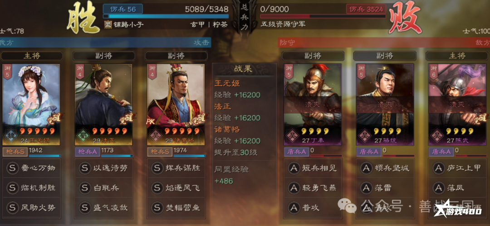

### 4) 7군왕

7군왕은 무조건 6창고 + 8장/9장/10장 임무폭발로 간다.

### 5) 7군왕 이후 1차 전환

* 도심혹적이 있는경우와 없는경우의 전법 배치가 다르다.
    * 잠피기봉 : 왕원희가 들고 1지력 + 지원갑 셋팅
    * 도심혹적 : 제갈각이 들고 3민첩 + 제갈각 올지력 셋팅 + 왕원희 올통솔

왕원희|SP마초|제갈각
|:---:|:---:|:---:|
잠룡진|유리한기회|해번위
__잠피기봉__|최봉단인|기세등등
지력|무력|통솔
지력1위 지원||

왕원희|SP마초|제갈각
|:---:|:---:|:---:|
잠룡진|유리한기회|해번위
__기세등등__|최봉단인|__도심혹적__
통솔|무력|지력

* 왕원희는 2+1로 16레벨까지 육성 이후 7군왕 달성 후 1훈련으로 20레벨을 만든다.

### 5) 7토

* 5군영 완성 이후 6시 ~ 11시에 7토를 진입한다.
* 도전적으로 33레벨, 안정적으로 35레벨에 7토를 진입한다. 
* 장각, 여포, 황개를 위주로 진입한다.
    * 장비를 만나면 전복 확률이 있다.

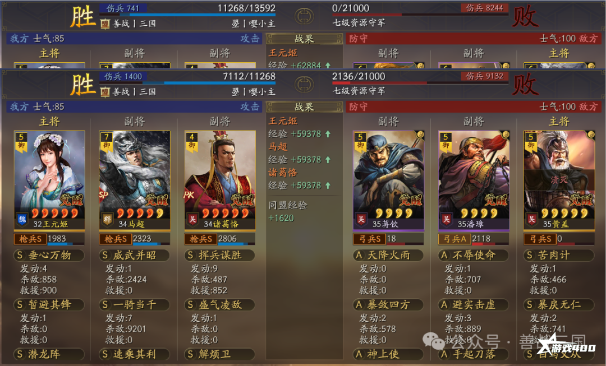
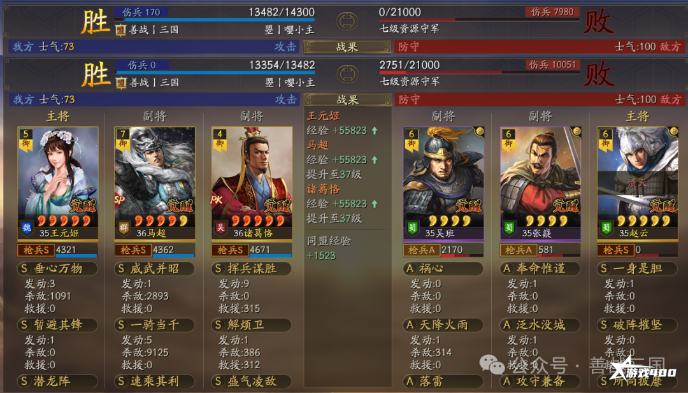

### 6) 7관문 공성

* 공성은 왕마제로 수행하고, 공성 종료 후 마황허 전환을 한다.
* 마초는 위압적인 자태를 들고, 제갈각이 주도권장악을 든다.

왕원희|SP마초|제갈각
|:---:|:---:|:---:|
잠룡진|최봉단인|해번위
임위구주|위압적인자태|주도권장악
지력|무력|통솔
지력1위 지원||

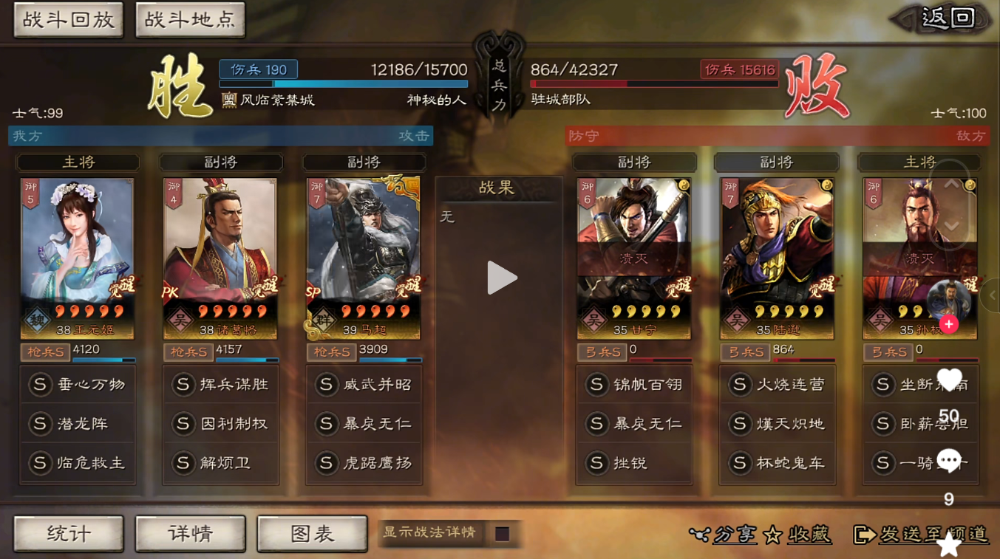
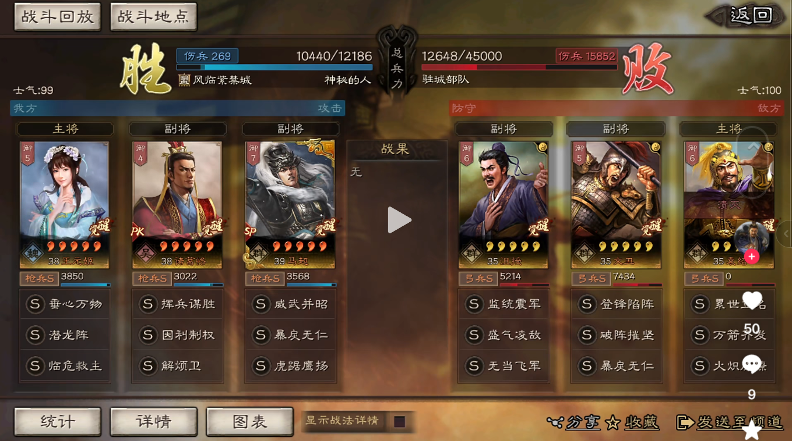
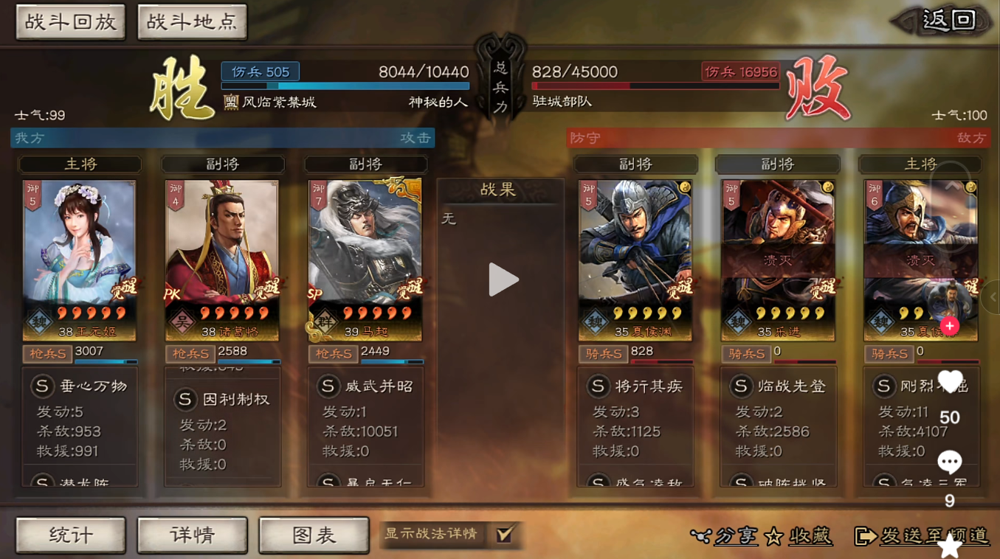

### 7) 마황허 전환 이후

* 개척에는 솔선수범 대신 유리한기회를 사용한다.
* 전환 후 부장 레벨이 30 미만인 경우, 6구리를 이용해 렙업을 한다.
* 부장의 레벨이 30을 넘어가면 7구리를 이용해 렙업을 할 수 있지만, 병서 개방 전에는 자제한다.
    * 7구리는 제갈량 또는 손권이 수비군인 경우 진입한다.
    * 유비 방패는 피한다.

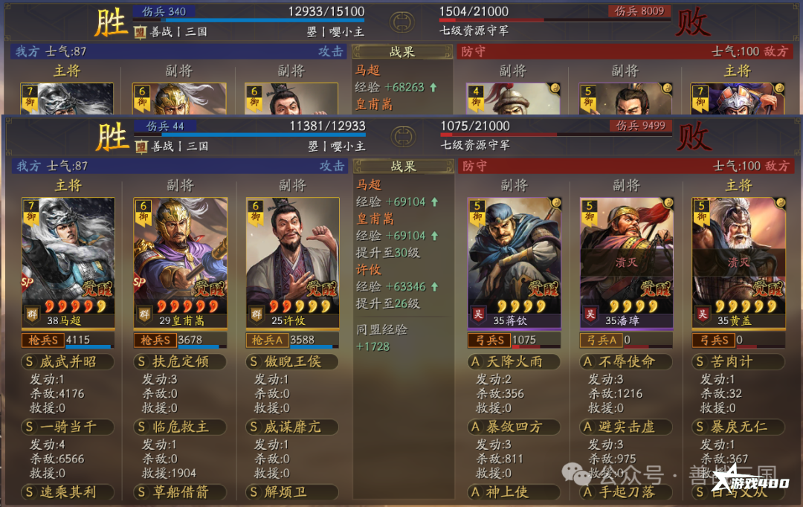
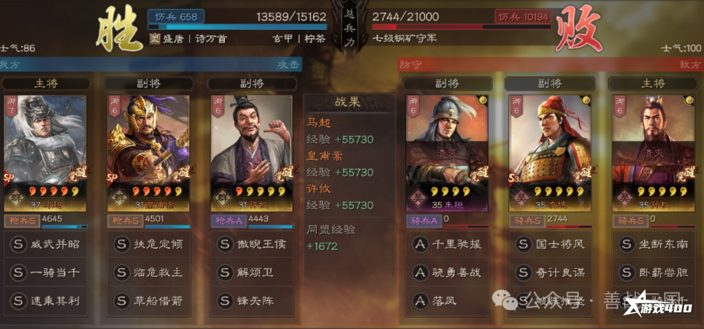
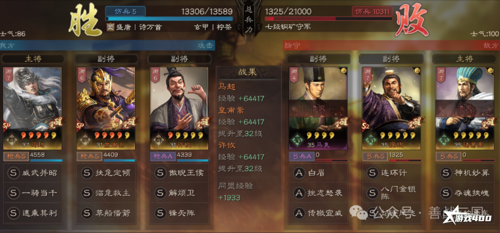
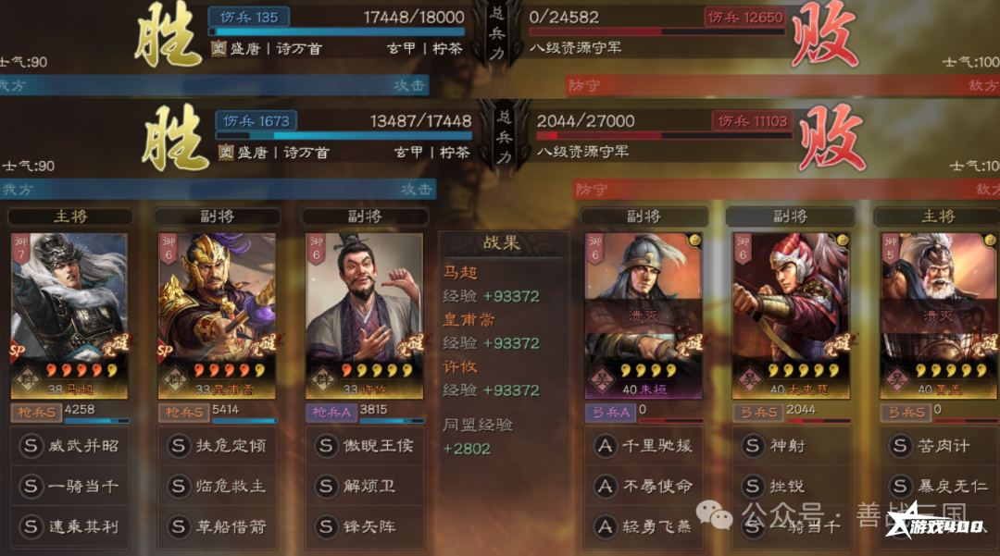

### 8) 참고 : 토지수비군 난이도

* 4토 : 곽사기 > 능조기 > 진무방 > 장량창 > 주환창 > 조창방
* 5토 : 조진기 > 진무방 > 반장창 > 이각기 > 장량창 > 조창방
* 6토 : 조창기 > 주환기 > 가규창 > 곽회방 > 정봉창 > 문빙방
* 7토 : 하후돈기 > 황개궁 > 장료창 > 장각방 > 여포기 > 조운창

난이도 목록에 없는 토지는 진입하지 않는다.