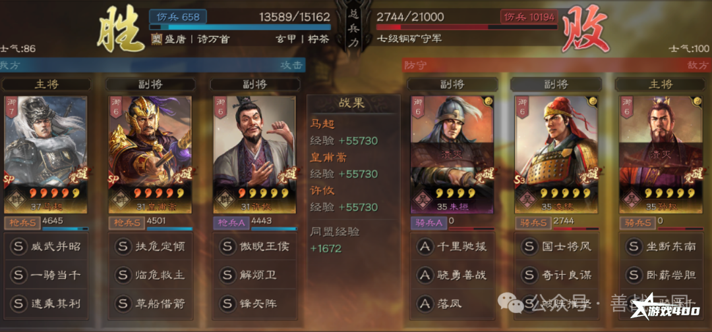

#법마제 개척

## 링크

https://www.yx400.com/show-jQvHqfYJyk.html
https://www.douyin.com/search/%E4%B8%89%E5%9B%BD%E5%BF%97%E6%88%98%E7%95%A5%E7%89%88%E6%B3%95%E5%85%8B%E9%A9%AC%E5%BC%80%E8%8D%92?modal_id=7400047130867420443&type=general
https://www.douyin.com/search/%E4%B8%89%E5%9B%BD%E5%BF%97%E6%88%98%E7%95%A5%E7%89%88%E6%B3%95%E5%85%8B%E9%A9%AC%E5%BC%80%E8%8D%92?modal_id=7415174570824584500&type=general

## 시작 개척덱(~20렙)

### 1) 4토

창병폼(고정)

제갈각|SP마초|법정
|:---:|:---:|:---:|
해번위|유리한기회|기세등등
통솔|무력|통솔

법정|SP마초|제갈각
|:---:|:---:|:---:|
잠룡진|일기당천|해번위
통솔|무력|통솔
* 능조 기병은 일기당천 -> 유리한기회

* 관악제와 다르게 창병 고정상태에서 궁병(황권, 장흠)토지에도 들어가도 괜찮다. 하지만, 관악제와 동일하게 4토에 진입하자.(창병이니까)

* 4토 진입순서 : 능조기병 > 장익방패 > 곽사기병 > 조창방패 > 장량창병 
장흠궁병, 주환창병, 황권궁병은 10레벨 이후에 진입하며, 가급적 스킵한다.
    * 관악제와 동일하다.

* __5렙부터 시작해서 4토 4개 점령후 10렙이 되면 5토에 진입한다.__

### 2) 5토 (20렙 전)

* 반장창병, 장량창병, 조진기병, 이각기병, 진무방패병을 찾아 가까운 거리의 토지부터 진입한다.
    * 군기병은 반격때문에 폭탄을 터트리기 어렵다.
* 진교는 1+2에 마초가 진입하도록 남겨둔다.
* 궁병은 20렙 전에 안들어간다.
* __* 주의 * 폭탄은 피해 정도를 엄격하게 만족시키고 진입한다.__

## 20렙 이후 개척덱

* 20렙 : __아무 5토나 폭격한다.__
* 25렙 : 6토 시도한다.
    * 6토를 시도한다.
    * 2+1 / 1+2 운영을 시작한다.
* 30렙 : 6구리를 시도한다.
* 35렙 : 5군영을 완성하고 7토를 트라이 한다.

### 1) 5토

법정|SP마초|제갈각
|:---:|:---:|:---:|
잠룡진|일기당천|해번위
기세등등|유리한기회|임기재승
통솔|무력|통솔

### 2) 2+1 / 1+2

* 25렙이 달성되면 2+1과 1+2를 운영하며 왕원희를 키워 7군왕때 전환해준다.
* 주의사항 : 적군 부대의 총 숫자는 아군 부대의 3배를 넘지않도록 한다.

2+1
법정|제갈각|쫄
|:---:|:---:|:---:|
불꽃바람|무당비군|기세등등 or 삼세진진
상병벌모|임기재승|

2+왕원희(20렙 이후)
왕원희|법정|제갈각
|:---:|:---:|:---:|
임기재승|백이병|불꽃바람
불난데부채질|기세등등|불타는군영

1+2
SP마초|쫄|쫄
|:---:|:---:|:---:|
일기당천|호표기|봉시진
유리한기회||

* 진교 방패를 우선으로 찾아 들어간다.
* 진교 방패가 없다면 궁병을 찾는다.

### 3) 6토

1차 전환 이전 6토는 석재 1개만 들어간다.

__나머지 6토는 7군왕 이후 1차 전환 후 진입한다.__

### 4) 7군왕 이후 1차 전환

왕원희|SP마초|제갈각
|:---:|:---:|:---:|
잠룡진|일기당천|해번위
잠피기봉|유리한기회|기세등등등
지력|통솔|무력

### 5) 7토

* 34렙 10군영 이후 7토에 장각을 찾아서도전한다. 
* 조운과 장비의 난이도가 높기때문에 섣불리 진입하지 않는다.

### 6) 마황허 전환 이후

* 개척에는 솔선수범 대신 일기당천을 사용한다.
* 전환 후 부장 레벨이 30 미만인 경우, 6구리를 이용해 렙업을 한다.
* 부장의 레벨이 30을 넘어가면 7구리를 이용해 렙업을 할 수 있지만, 병서 개방 전에는 자제한다.
    * 7구리는 제갈량 또는 손권이 수비군인 경우 진입한다.
    * 유비 방패는 피한다.

### 7) 참고 : 토지수비군 난이도

* 4토 : 곽사기 > 능조기 > 진무방 > 장량창 > 주환창 > 조창방
* 5토 : 조진기 > 진무방 > 반장창 > 이각기 > 장량창 > 조창방
* 6토 : 조창기 > 주환기 > 가규창 > 곽회방 > 정봉창 > 문빙방
* 7토 : 하후돈기 > 황개궁 > 장료창 > 장각방 > 며포기 > 조운창

난이도 목록에 없는 토지는 진입하지 않는다.