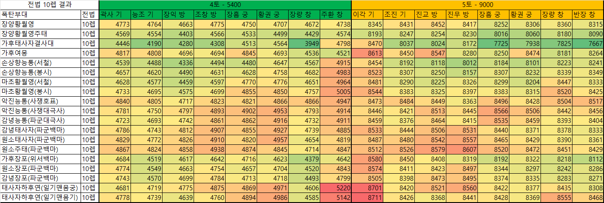

# 폭탄덱 정리

~~폭탄을 던지려면 가후 장양 봉기 황월영은 갖추고 시작하자~~

## 폭탄덱의 분류

1) 고정딜 폭탄(봉시진 or 호표기 폭탄)

|주장|전법|부장|전법|기대데미지|
|:---:|:---:|:---:|:---:|:---:|
|손상향|맨몸의혈전|능통|호표기|300~1000|
|마초|맨몸의혈전|능통|호표기|300~1000|
|장양|문무겸비|황월영|봉시진|500~900|
|악진|사쟁선부|능통|대극사 or 호표기|300~800|

- 폭탄을 던졌을 때 데미지가 보장되는 유형.
- 주로 4토 진입시 또는 15레벨 이후 2000명 전후의 __보장__ 데미지가 필요한 경우 사용한다.

2) 유사 고정딜 폭탄(파군승리 폭탄)

|주장|전법|부장|전법|기대데미지|
|:---:|:---:|:---:|:---:|:---:|
|감녕|파군승리|능통|호표기|300~800|
|감녕|파군승리|태사자|백마의종|300~800|
|원소|파군승리|태사자/주태|백마의종|300~800|
|원소|파군승리|장포|백마의종|300~900|

- 파군승리가 터지면 고정딜 폭탄 만큼의 데미지가 들어가지면, 확률에 의해 불발이 될 가능성이 많은 폭탄.
- 고정딜 폭탄이 부족한 경우 사용한다.

## 폭탄덱 시뮬레이션 결과 정리

1) 모든 경우에서 폭탄 기대값이 가장 높은 조합은 가후(위서)태사자(적제)결사대(백마)
2) 전법렙이 10렙인 경우, 서철 vs 봉시는 서철 폭탄의 기대값이 더 높다
3) 전법렙이 1렙인 경우, 서철 vs 봉시는 큰 차이가 없다. 하지만 기대값도 낮다.
4) 폭탄덱의 전법에 투자가 불가능하다면 무조건 가태결 폭탄을 쓴다. 2순위로는 장황 또는 가여
5) 5토 군기병(이각)의 폭탄 적중률이 가장 낮다 → 11렙 첫 5토로 선택하기 어렵다.

## 봉시진 vs 뒤섞인 위서

* 봉시진을 채용하는 폭탄

|주장|전법|부장|전법|부장|전법|
|:---:|:---:|:---:|:---:|:---:|:---:|
|장양|문무겸비|황월영/능통|___봉시진___|||
|마초|맨몸의혈전|황월영/능통|___봉시진___|||
|손상향|맨몸의혈전|황월영/능통|___봉시진___|||
|하후연|맨몸의혈전|황월영/능통|___봉시진___|||
|장료|적진습격|황월영/능통|___봉시진___|||
|태사자|적진습격|황월영/능통|___봉시진___|||
|장양|문무겸비|황월영|___봉시진___|주태|장자의바람|

* 뒤섞인 위서를 채용하는 폭탄 (___4토에서는 사용하지 못한다___)

|주장|전법|부장|전법|부장|전법|
|:---:|:---:|:---:|:---:|:---:|:---:|
|여몽|백마의종|가후/봉기|___뒤섞인 위서___|||
|초선|백마의종|가후/봉기|___뒤섞인 위서___|||
|장춘화|백마의종|가후/봉기|___뒤섞인 위서___|||
|공손찬|수이필고|가후/봉기|___뒤섞인 위서___|||
|가후|뒤섞인 위서|태사자|적군제압|결사대|백마의종|
|가후|___뒤섞인 위서___|장포|백마의종|||

## 3인 폭탄은 어떻게 던질까?

* 열병대가 아닌 숙소를 1개 더 열고 쓴다.
* 개척부대를 2숙소/3숙소로 옮기고, 1숙소에 폭탄 3인 채용을 연습해야한다.

## 장양과 봉기

* 장양 : 주태가 없어도 안정적으로 폭탄을 터트린다.
* 봉기 : 가후와 동일하게 위서를 사용한다. 5토 이상의 고토에서 성능이 더 좋다

## 폭탄 참조 테이블

* 진급은 속성에 영향을 주므로, 본인 개척부대의 모든 진급현황을 더해 본인이 해당하는 레벨에 해당 토지를 진입한다.
* 4토에서는 봉시진 폭탄만 사용한다.
* 5토에서는 혼란 폭탄의 성능이 더 좋다.

## 연속으로 폭탄을 던지는 예시

* 주장이 먼저 죽도록 셋팅해주고, 주장만 갈아끼워 폭탄을 던지다가, 주장 부장 다 죽으면 다른 폭탄쌍을 끼워넣고 던진다.