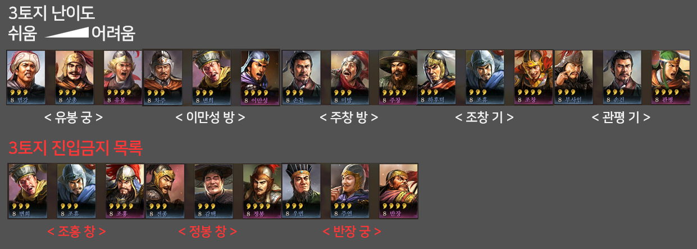
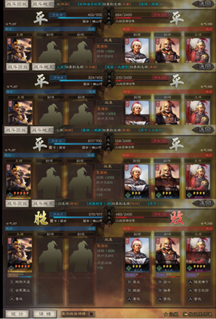
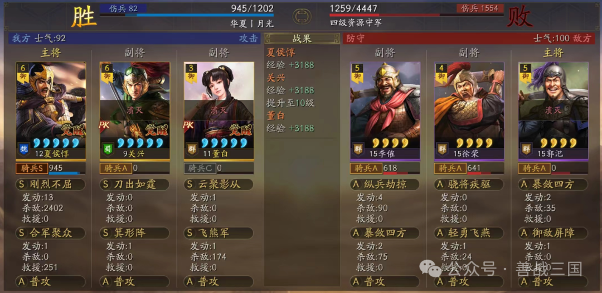
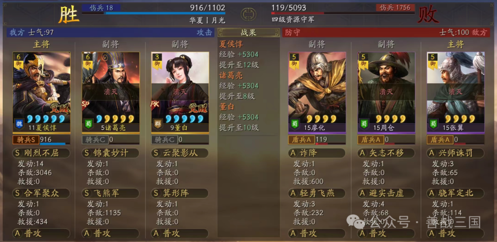
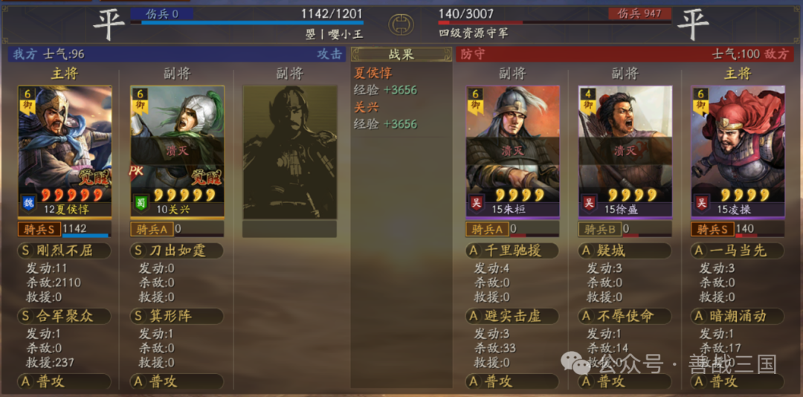
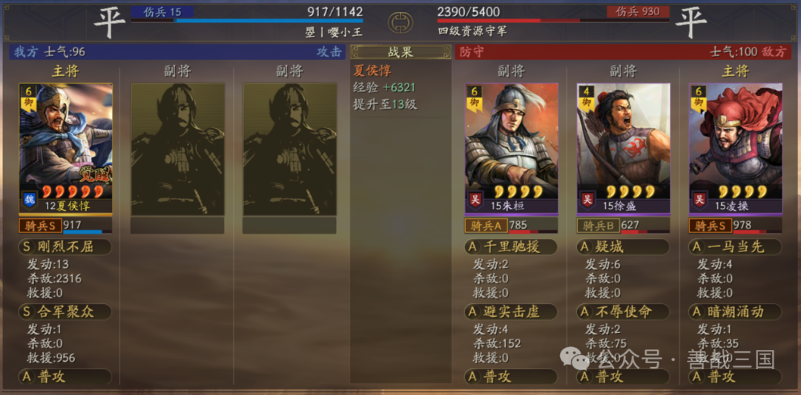
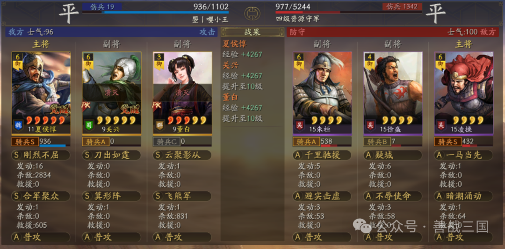

# 하후돈 개척


~~돈형의 매운맛을 봐라~~

## 개척의 컨셉

1) 하후돈 1인 개척으로 빠른 20렙 달성
2) 하후돈 20렙 이후 1+1과 1+2를 활용한 2인부대의 우선 육성 (북벌창 : SP제갈량 + 관흥 / 주원장 : 주태 + 장비)
3) 5토 점령부대 2부대 운용을 통한 빠른 세력치 확장
4) 훈련소 없이 병기장수 육성하기

## 개척의 시작

- 3숙소 오픈
- 부대 셋팅
    - 3번숙소 : 하후돈 (올통솔, 병력소집, 기병, 풀병력)
    - 2번숙소 : 길작부대 (손능, 장황, 감태...)
    - 1번숙소 : 2인개척부대(SP제갈량+관흥, 채문희+장비+주태...)
- 3토 정찰 시작
    - 유봉을 찾는다.

## 3토의 진입 (하후돈 3행동)

- 3토 진입 우선순위
    - 유봉 궁 > 이만성 방 > 주창 방 > 조창 기 > 관평 기
    - 조홍, 정봉, 반장은 들어가지 않는다.


- 3토를 3개 점령한다.
    1) 길작부대 투입
    2) 수비군 회복 3분 이하가 될 때 까지 대기
    3) 하후돈 진입
    4) 2무 발생 후 3번째 전투에서 점령(무/무/승)
    5) 1행동 3전투로 경험치 수급
    

``` c++
3토를 3개 점령하면 10레벨을 달성한다.
```


## 4토의 진입 (하후돈 18행동 / 누적 21행동)

- 부대 셋팅
    - 하후돈 : 올통솔, 병력소집, 기병, 풀병력
    - 무력최고 부장 : 기형진, 병력1
    - 3코스트 부장 : 비웅군, 병력1

- 4턴 소모 : 12레벨 만든다. (3렙토지 5개 임무 완료)
    - 장익 방, 이각 기를 찾아 진입한다.
        - 능조는 찾아서 기록해둔다.
    
        
    - ~~4석재에 둔전 1회 실시한다.~~ -> 둔전 임무 없이 14시 이전 명성 4000이 달성되면 둔전을 하지 않는다.

- 14턴 소모 : 능조 우려먹으며 20레벨 만든다.
    - 하후돈 : 올통솔, 병력소집, 기병, 풀병력
    
    - 부장 : 기형진, 병력1 (12레벨 이후 비웅군 금지)
    
    - 참고 사항
        
        - 무승부 렙업 도중 하후돈의 병력이 1100명 이하로 떨어지면 퇴각한다.
        
        - 15레벨 이후 하후돈의 병력이 1500명이 넘지 않도록 한다.
        
         
        
        - 부장 2인을 돌아가며 육성하여 하후돈이 20레벨이 되는 시점에 부장들은 15레벨이 되도록 한다.  
        
        - [참고] 12레벨 이전에는 비웅군이 사용 가능하다.
        
         
        
=================================


## 5토의 진입

- 5토 진입 순서
    - 20레벨 : 이각 기병
    - 21레벨 : 진무 방패
    - 23레벨 : 조진 기병
    - 24레벨 : 장흠 궁병
    - 27레벨 : 반장 창병
    - 28레벨 : 장량 창병

- 이각, 진무를 이용해 부장20렙을 맞추고, 부장20렙 이후 2부대로 5토를 점령한다.(토요일 오후 6시)
- 3코장수 쫄로 붙이고 9턴 소모해 20레벨 달성 (토요일 오후 9시)

## 전환 개척 부대의 육성
- 토요일 저녁 9시에 3장수 부대 달성 (2인장수 25렙, 3코장수 20렙)
- 병기장수 2인(총합 9코스트) 11턴 소모하여 20레벨 달성
    - 1군 3번째 장수가 병기로 사용 가능한 경우(sp원소) : 병기장수 3인 훈련 6시간 수행
    - 1군 3번째 장수가 병기로 사용 불가능한 경우(장포) : 병기장수 4인 훈련 8시간 수행
- 전환 1군의 3번째 장수 40턴 소모 (일요일 밤 11시까지)
    - 3번째 장수 30레벨 목표

## 이후
- 월요일 오전 8시 공성 수행
- 월요일 점심 12시 ~ 1시 사이 19코 달성